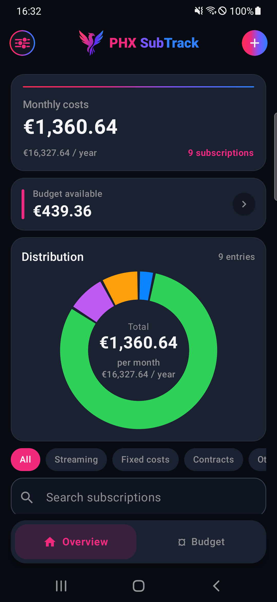
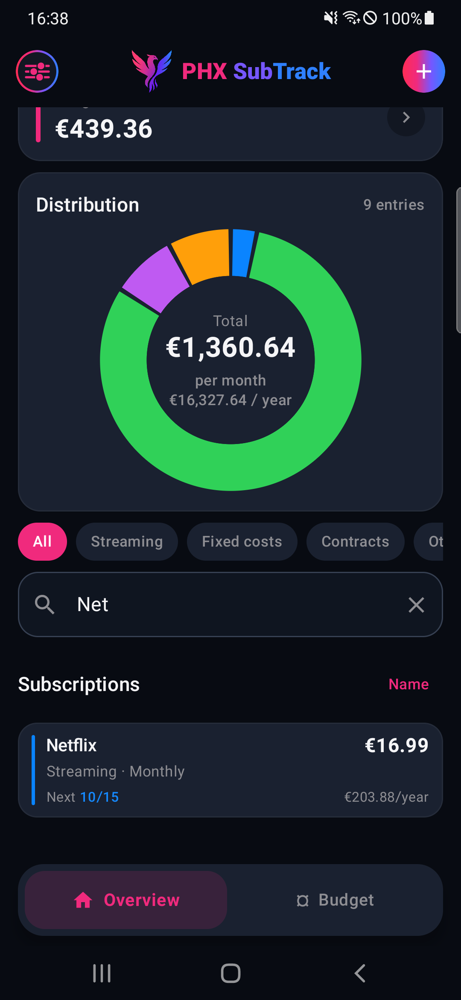
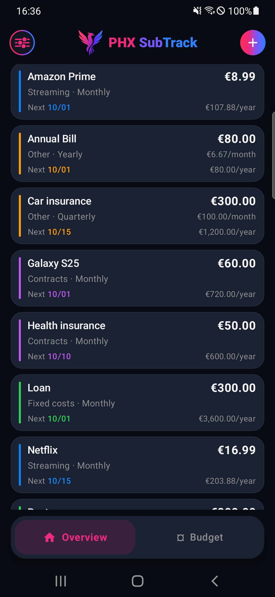
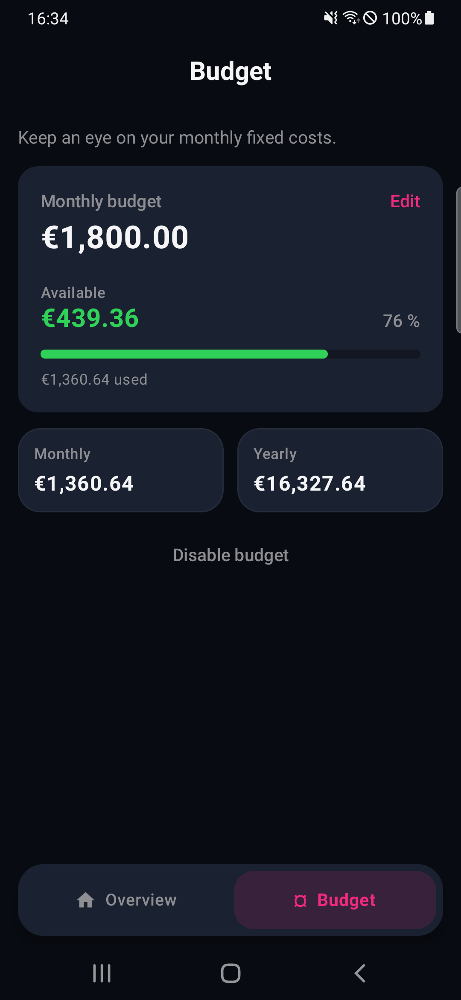
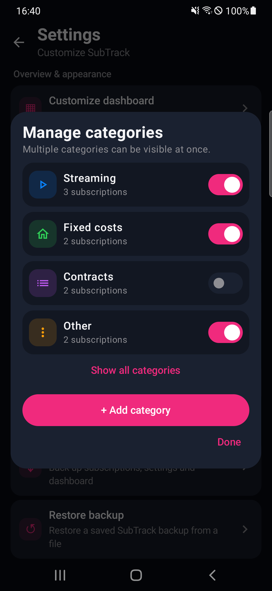
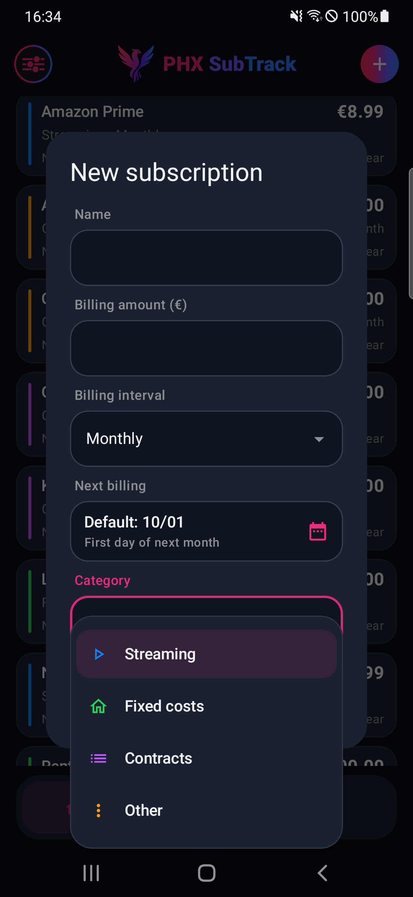
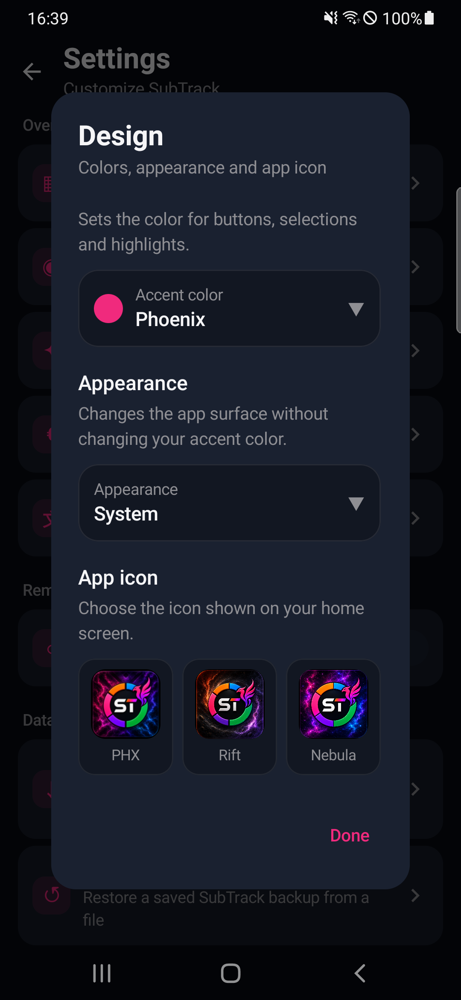
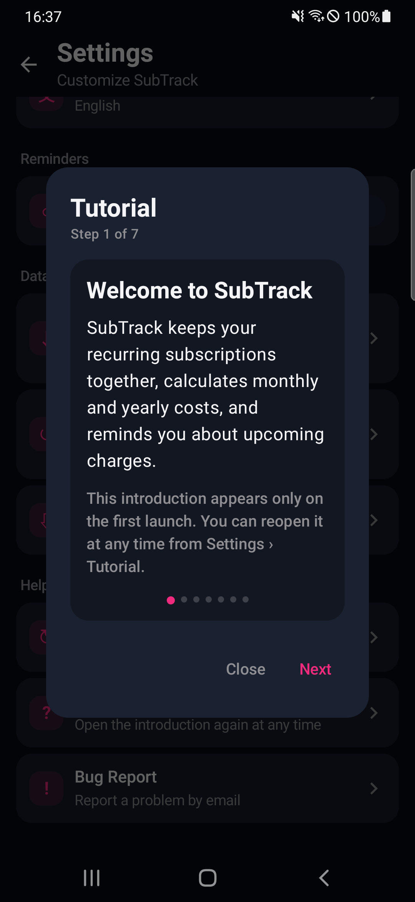
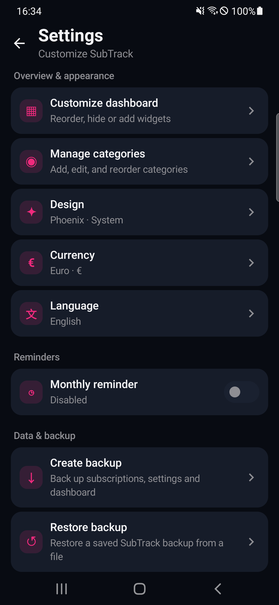
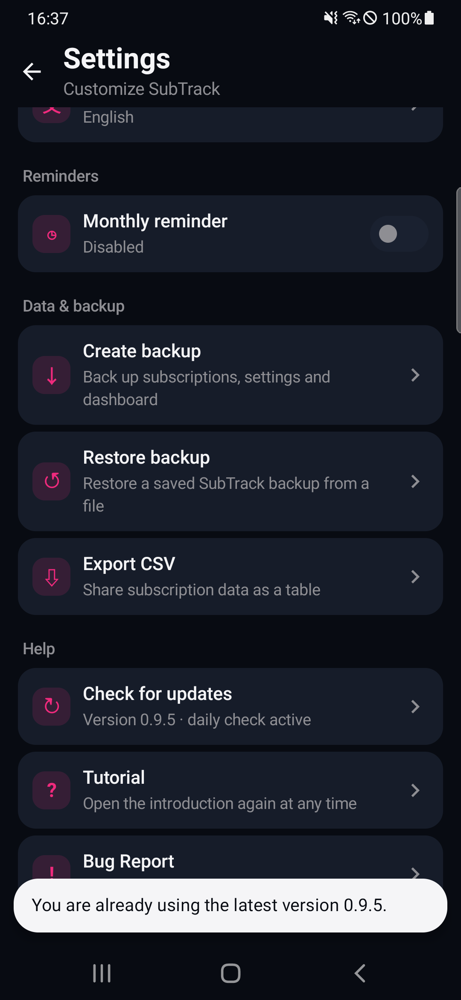

# PHX SubTrack

  <strong>A focused subscription tracker for Android.</strong> 
  Keep recurring costs, budgets, categories, reminders, and backups in one place.

  
  
  

> [!IMPORTANT]
> PHX SubTrack 0.9.5 is a beta release. Back up your data regularly while the app is still being tested.

## Download

Download the current APK from the [PHX SubTrack 0.9.5 Beta release](https://github.com/MCJocky/PHX-SubTrack-Realeses/releases/tag/v0.9.5).

The official release file is named **`SubTrack.apk`**. PHX SubTrack requires Android 8.0 (API 26) or newer.

## Features

- Monthly and yearly subscription totals
- Configurable monthly budget with remaining balance
- Search by partial subscription name, independent of capitalization
- Category filters, charts, and compact subscription cards
- Built-in and custom categories with visibility and ordering controls
- Safe reassignment when deleting a custom category that contains subscriptions
- Monthly, quarterly, half-yearly, and yearly billing intervals
- Upcoming billing overview and optional reminders
- German, English, and system language support
- Multiple accent colors, appearances, and app icons
- JSON backup and restore plus CSV export
- First-launch tutorial that can be reopened from Settings
- Daily update checks and a manual update check through GitHub Releases

## Screenshots

<table>
  <tr>
    <td align="center"><strong>Dashboard</strong> </td>
    <td align="center"><strong>Search</strong> </td>
  </tr>
  <tr>
    <td align="center"><strong>Subscription list</strong> </td>
    <td align="center"><strong>Budget</strong> </td>
  </tr>
  <tr>
    <td align="center"><strong>Category management</strong> </td>
    <td align="center"><strong>Add a subscription</strong> </td>
  </tr>
  <tr>
    <td align="center"><strong>Design</strong> </td>
    <td align="center"><strong>Tutorial</strong> </td>
  </tr>
  <tr>
    <td align="center"><strong>Settings</strong> </td>
    <td align="center"><strong>Update check</strong> </td>
  </tr>
</table>

Additional screenshots are available in the [`screenshots`](screenshots) directory.

## Installation

1. Download **`SubTrack.apk`** from the 0.9.5 Beta release.
2. Open the downloaded APK on your Android device.
3. If Android asks, allow your browser or file manager to install apps from this source.
4. Complete the installation and open SubTrack.

Future versions are checked once per day. You can also run a manual check from **Settings → Check for updates**.

## Data and backups

Subscription data and settings remain on your device. Backups are created only when you choose **Create backup**.

Before installing a beta update, create a current backup from **Settings → Create backup**.

## Languages and appearance

SubTrack supports German, English, and the Android system language. Available appearances include Light, Graphite, Midnight, Deep Black, and System, combined with selectable accent colors and app icons.

## Beta feedback

Use **Settings → Bug Report** inside the app or open a [GitHub issue](https://github.com/MCJocky/PHX-SubTrack-Realeses/issues) if you encounter a problem.

## Release history

See [CHANGELOG.md](CHANGELOG.md) for the current beta changes.
