# PHX SubTrack

  <strong>A focused subscription tracker for Android phones and tablets.</strong> 
  Keep recurring costs, budgets, categories, reminders, and backups in one place.

  
  
  

> [!IMPORTANT]
> PHX SubTrack 0.9.7 is a beta release. Create a current backup before installing an update.

## Download

Download **`SubTrack.apk`** from the [PHX SubTrack 0.9.7 Beta release](https://github.com/MCJocky/PHX-SubTrack-Releases/releases/tag/v0.9.7).

PHX SubTrack requires Android 8.0 (API 26) or newer. The same APK supports phones and tablets.

## Highlights

- Adaptive layouts for compact phones, portrait tablets, and landscape tablets
- Portrait orientation on phones, while tablets support portrait and landscape
- Four main pages: Overview, Subscriptions, Budget, and Settings
- Responsive overview with a donut chart, category totals, and next-due information
- Optional monthly-cost and available-budget cards that can be shown, hidden, and reordered
- Search by the beginning of a subscription name or any word in it
- Built-in and custom categories with filters, colors, visibility, and ordering controls
- Monthly budget, remaining balance, and category breakdowns
- Monthly, quarterly, half-yearly, and yearly billing intervals
- Optional reminders and daily GitHub update checks
- App languages: German and English
- Light, Graphite, Midnight, Deep Black, and System appearances
- Multiple accent colors and selectable app icons
- JSON backup and restore plus CSV export
- No account, advertisements, subscriptions, or locked features

## Screenshots

### Smartphone

<table>
  <tr>
    <td align="center"><strong>Overview</strong> <a href="screenshots/0.9.7/smartphone/overview.png">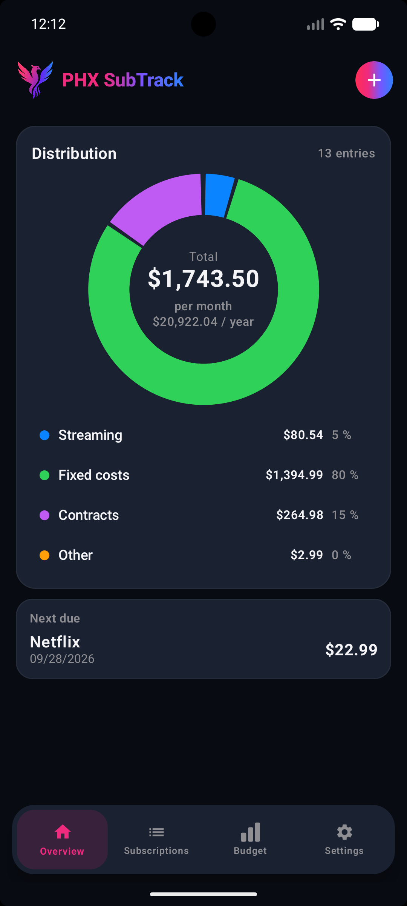</a></td>
    <td align="center"><strong>Subscriptions</strong> <a href="screenshots/0.9.7/smartphone/subscriptions.png">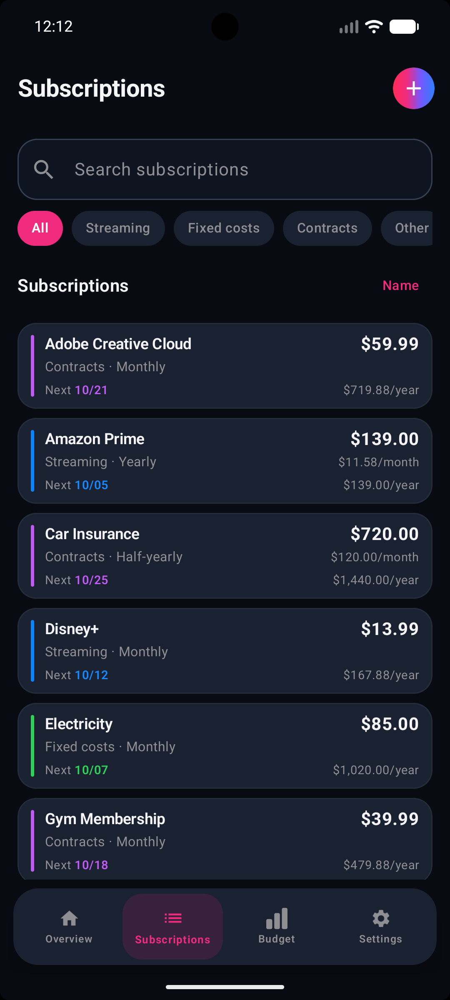</a></td>
    <td align="center"><strong>Budget</strong> <a href="screenshots/0.9.7/smartphone/budget.png">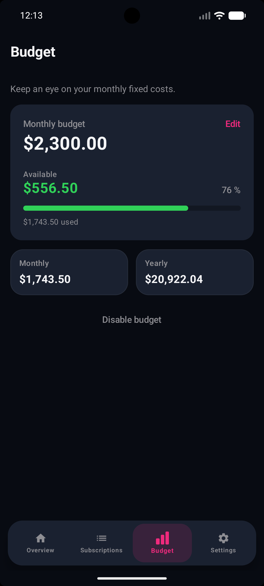</a></td>
    <td align="center"><strong>Settings</strong> <a href="screenshots/0.9.7/smartphone/settings.png">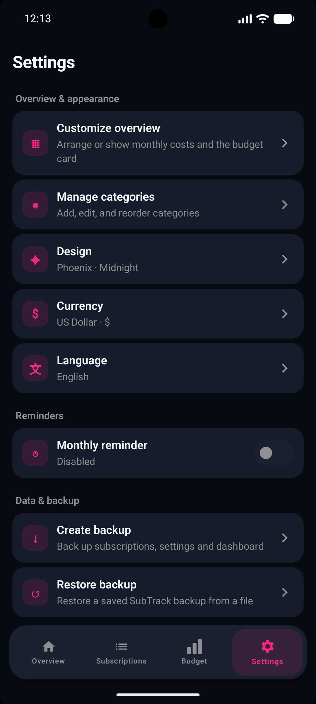</a></td>
  </tr>
</table>

### Tablet landscape

<table>
  <tr>
    <td align="center"><strong>Overview</strong> <a href="screenshots/0.9.7/tablet/overview-landscape.png">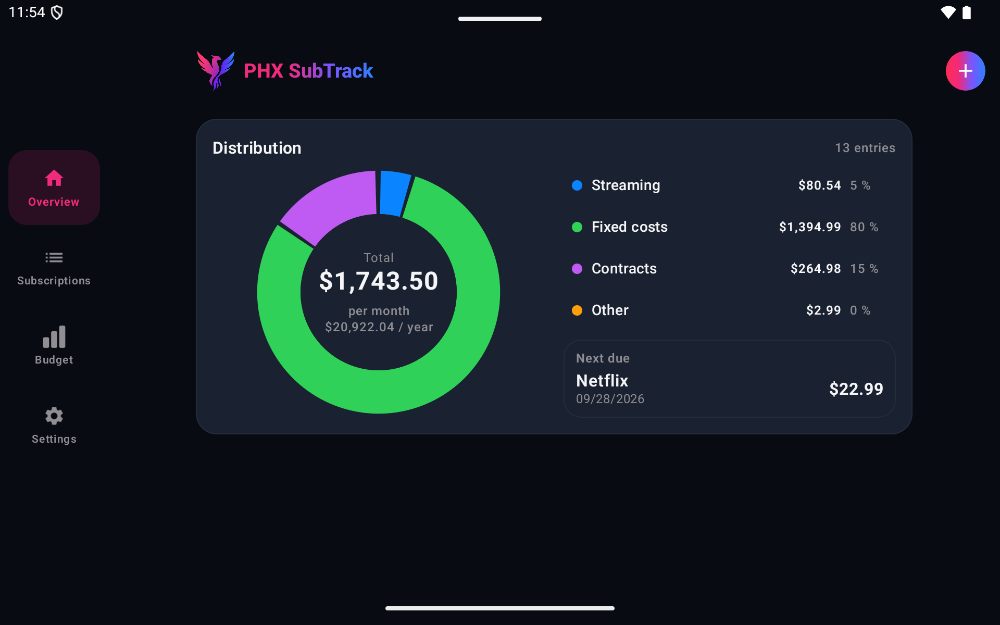</a></td>
    <td align="center"><strong>Subscriptions</strong> <a href="screenshots/0.9.7/tablet/subscriptions-landscape.png">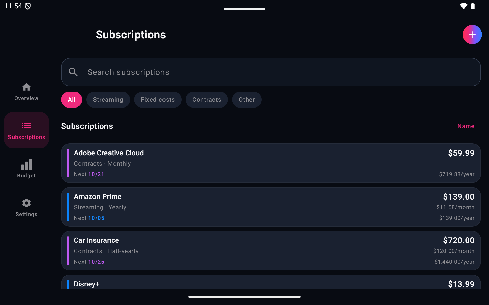</a></td>
  </tr>
  <tr>
    <td align="center"><strong>Budget</strong> <a href="screenshots/0.9.7/tablet/budget-landscape.png">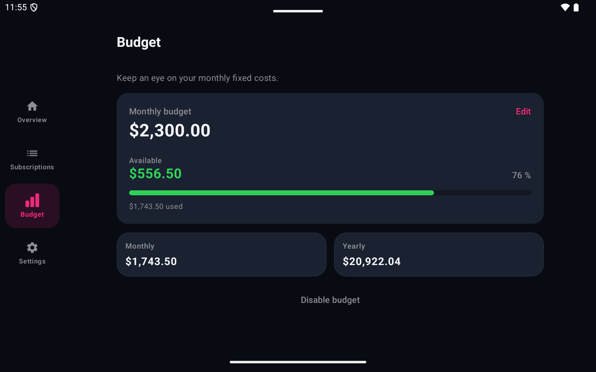</a></td>
    <td align="center"><strong>Settings</strong> <a href="screenshots/0.9.7/tablet/settings-landscape.png">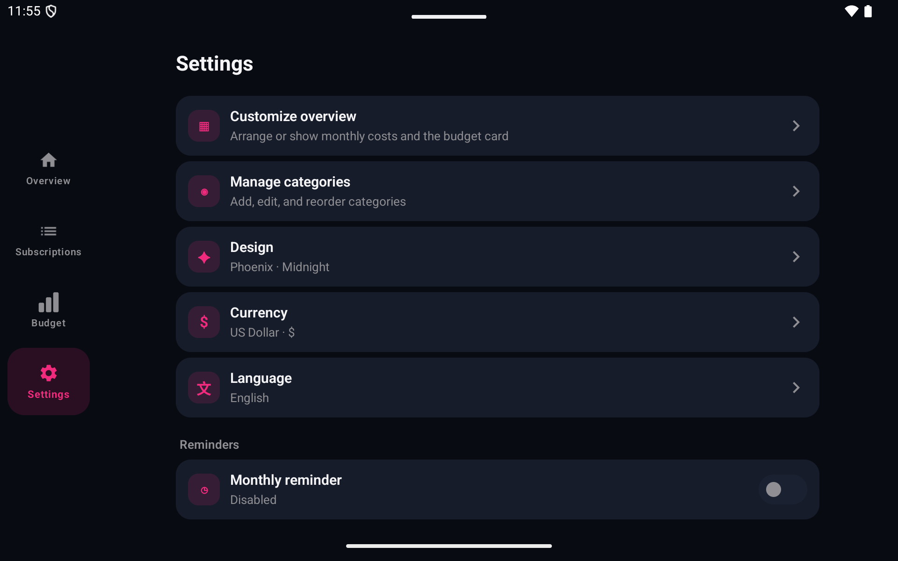</a></td>
  </tr>
</table>

### Tablet portrait

<table>
  <tr>
    <td align="center"><strong>Overview</strong> <a href="screenshots/0.9.7/tablet/overview-portrait.png">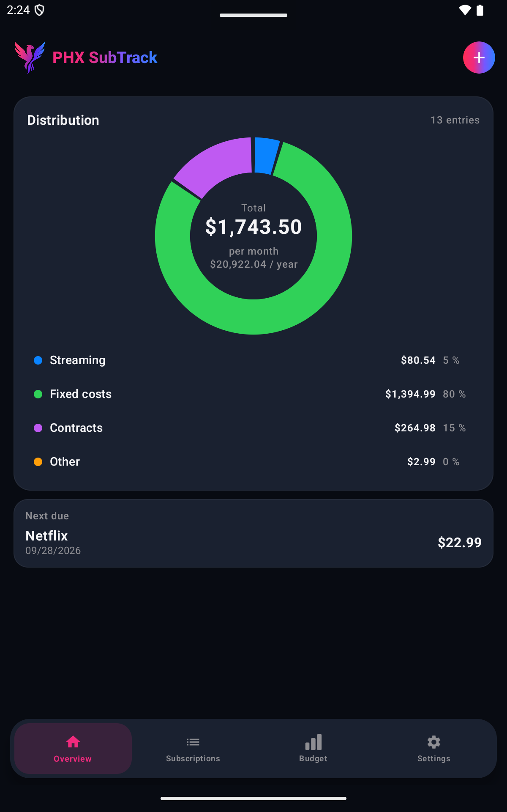</a></td>
    <td align="center"><strong>Subscriptions</strong> <a href="screenshots/0.9.7/tablet/subscriptions-portrait.png">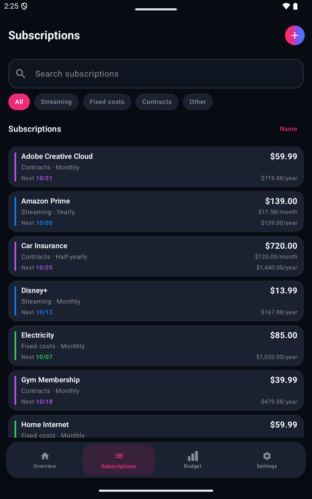</a></td>
    <td align="center"><strong>Settings</strong> <a href="screenshots/0.9.7/tablet/settings-portrait.png">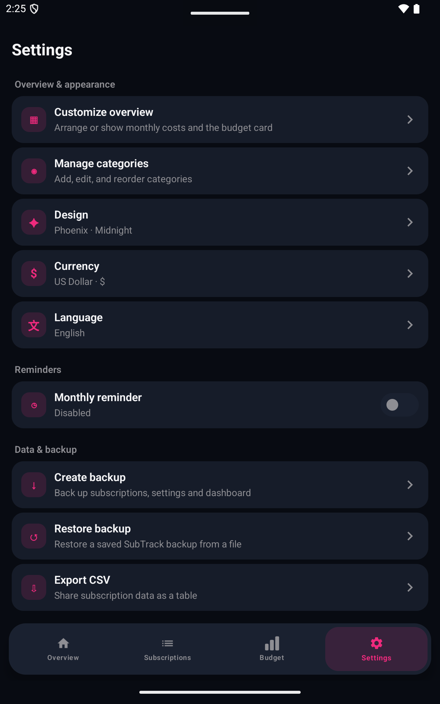</a></td>
  </tr>
</table>

Additional 0.9.7 screenshots are available in the [`screenshots/0.9.7`](screenshots/0.9.7) directory.

## Installation

1. Download **`SubTrack.apk`** from the 0.9.7 Beta release.
2. Open the downloaded APK on your Android device.
3. If Android asks, allow your browser or file manager to install apps from this source.
4. Install the update over your existing SubTrack version to retain local data.

SubTrack checks GitHub Releases once per day. You can also run a manual check from **Settings → Check for updates**.

## Data and backups

Subscription data and settings remain on your device. Backups are created only when you choose **Create backup**. Existing 0.9.5 and 0.9.6 app data and backups remain compatible with 0.9.7.

## Beta feedback

Use **Settings → Bug Report** inside the app or open a [GitHub issue](https://github.com/MCJocky/PHX-SubTrack-Releases/issues) if you encounter a problem.

## Release history

See [CHANGELOG.md](CHANGELOG.md) for the complete beta changes.
